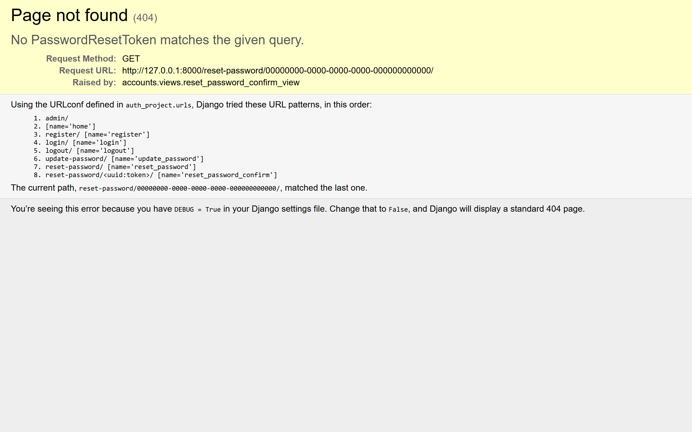

# SneakerAuth

Sistema de autenticación Django (register, login, update password, reset password) con temática e-commerce de calzado, diseño SAAS en claro, y base de datos MySQL.

## Stack

- **Backend:** Django 6.0.5, Python 3
- **Frontend:** CSS vanilla (Inter, diseño responsivo, animaciones)
- **Base de datos:** MySQL 8+ (conector mysqlclient)
- **Templates:** Django Templates (sin JS)

## Estructura

```
auth/
├── accounts/                 # App de autenticación
│   ├── templates/accounts/   # 4 HTMLs
│   │   ├── login.html
│   │   ├── register.html
│   │   ├── update_password.html
│   │   └── reset_password.html
│   ├── forms.py              # 5 forms (Register, Login, UpdatePassword, ResetRequest, ResetConfirm)
│   ├── models.py             # PasswordResetToken (UUID, user FK, is_used, created_at)
│   ├── urls.py               # 7 rutas
│   └── views.py              # 6 views (register, login, logout, update, reset_request, reset_confirm)
├── auth_project/
│   └── settings.py           # MySQL auth_db, static/, templates/, LOGIN_URL
├── static/css/
│   └── style.css             # Único stylesheet (~600 líneas)
├── db.sql                    # Schema MySQL (2 tablas, 2 vistas, 3 triggers)
├── manage.py
├── requirements.txt
└── README.md
```

## Funcionalidades

| Ruta | Vista | Descripción |
|---|---|---|
| `/` o `/login/` | `login_view` | Inicio de sesión con AuthenticationForm |
| `/register/` | `register_view` | Registro con username, email, password x2 |
| `/logout/` | `logout_view` | Cierra sesión y redirige al login |
| `/update-password/` | `update_password_view` | Cambia contraseña (requiere login) |
| `/reset-password/` | `reset_password_request_view` | Solicita token de recuperación por email |
| `/reset-password/<uuid:token>/` | `reset_password_confirm_view` | Restablece contraseña con token |

## Capturas

| Login | Register |
|---|---|
|  |  |

| Update Password | Reset Password | Reset Confirm |
|---|---|---|
|  |  |  |

## Base de datos (MySQL)

**Conexión:** `root:root@localhost:3306/auth_db`

**Tablas:**
- `auth_user` — usuarios (id, password, username, email, is_active, date_joined, etc.)
- `accounts_passwordresettoken` — tokens UUID para reset de contraseña

**Vistas:**
- `vw_active_users` — usuarios activos
- `vw_valid_reset_tokens` — tokens vigentes (< 24h, no usados)

**Triggers:**
- `trg_user_before_insert` — normaliza email/username a minúsculas
- `trg_user_before_update` — preserva `last_login` original
- `trg_token_before_insert` — fuerza `created_at = NOW()`

## Diseño (SAAS en claro)

- **Paleta:** Indigo `#6366f1` primary, blanco `#ffffff` fondo, slate `#0f172a` texto
- **Layout two-column:** Sidebar brand (380px) + formulario (flex 1)
- **Sidebar contextual:** Icono, título, descripción, 3 features por página
- **20 objetos flotantes** con 10 trayectorias de animación (flA–flJ) cubriendo toda la pantalla
- **Animaciones:** fade in/out, rotaciones, 22s–38s de duración
- **Responsivo:** Colapsa sidebar a ≤860px, comprime form a ≤600px (floats se reducen a 20px/0.20)
- **Tipografía:** Inter (Google Fonts), jerarquía 24px/14px/13px
- **Inputs:** Fondo `#f1f5f9`, focus ring brand 4px
- **Mensajes:** Con iconos ✓/✕, animación spring
- **Sin JavaScript**

## Instalación

```bash
# 1. Clonar
git clone <repo>
cd auth

# 2. Entorno virtual
python -m venv venv
venv\Scripts\activate    # Windows

# 3. Dependencias
pip install -r requirements.txt

# 4. Base de datos
mysql -u root -p < db.sql

# 5. Migraciones
python manage.py migrate --fake-initial

# 6. Servidor
python manage.py runserver
```

## Notas

- Usar `--fake-initial` porque `auth_user` se crea manualmente vía `db.sql`
- El token de reset se muestra en pantalla (modo desarrollo) por falta de servidor SMTP
- Error `1146 (django_session)` se soluciona con `migrate --fake-initial`
- No usa dark mode, no necesita JavaScript
