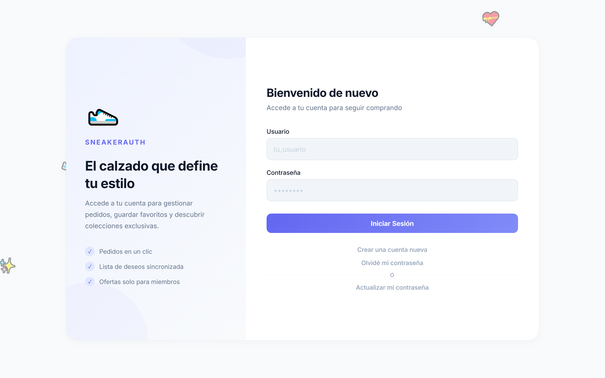
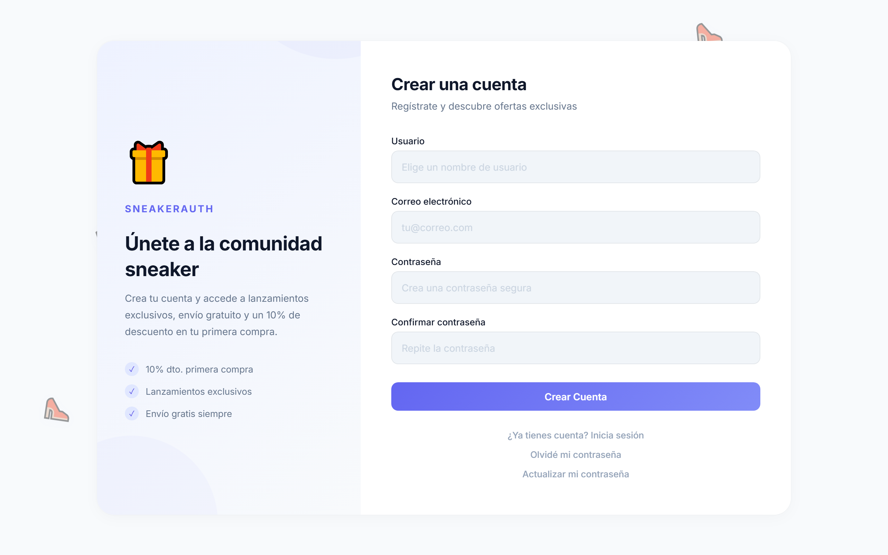
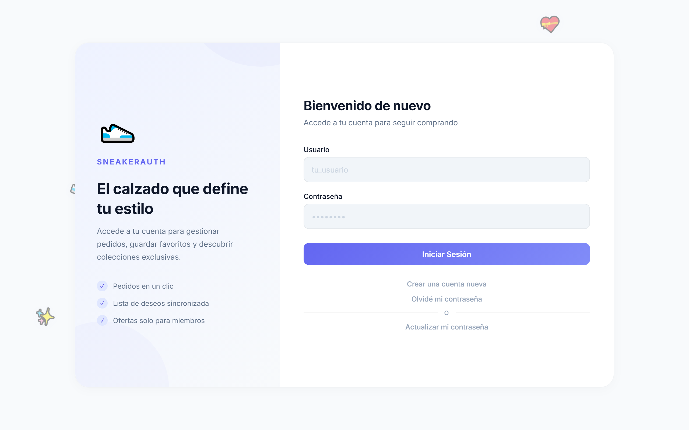
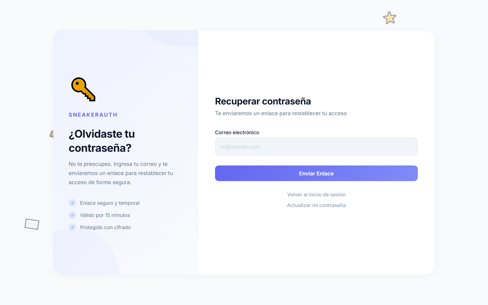

# Auth — Django Authentication System

Sistema de autenticación completo desarrollado con Django y MySQL. Incluye registro de usuarios, inicio de sesión, actualización de contraseña y recuperación de acceso mediante tokens. Diseño SAAS responsivo en modo claro, sin dependencias de JavaScript.

---

## Stack

| Capa | Tecnología |
|---|---|
| Backend | Django 6.0.5, Python 3.14 |
| Frontend | CSS3 (Flexbox, animaciones, custom properties) |
| Base de datos | MySQL 8+ via mysqlclient |
| Fuentes | Inter (Google Fonts) |

---

## Funcionalidades

| Ruta | Vista | Requiere auth | Descripción |
|---|---|---|---|
| `/login/` | `login_view` | — | Inicio de sesión con AuthenticationForm |
| `/register/` | `register_view` | — | Registro (username, email, password ×2) |
| `/logout/` | `logout_view` | — | Cierra sesión |
| `/update-password/` | `update_password_view` | Sí | Cambio de contraseña con validación |
| `/reset-password/` | `reset_password_request_view` | — | Solicita token de recuperación |
| `/reset-password/<uuid:token>/` | `reset_password_confirm_view` | — | Restablece contraseña con token |

---

## Capturas

| Login | Register |
|---|---|
|  |  |

| Update Password | Reset Password |
|---|---|
|  |  |

---

## Estructura del proyecto

```
auth/
├── accounts/                          # App de autenticación
│   ├── templates/accounts/
│   │   ├── login.html
│   │   ├── register.html
│   │   ├── update_password.html
│   │   └── reset_password.html
│   ├── forms.py                       # 5 formularios
│   ├── models.py                      # PasswordResetToken
│   ├── urls.py                        # 7 rutas
│   └── views.py                       # 6 vistas
├── auth_project/
│   └── settings.py                    # Configuración Django
├── static/css/
│   └── style.css                      # Único stylesheet
├── screenshots/                       # Capturas de pantalla
├── db.sql                             # Schema MySQL completo
├── manage.py
├── requirements.txt
└── README.md
```

---

## Base de datos

**Conexión:** `root:root@localhost:3306/auth_db`

### Tablas

| Tabla | Propósito |
|---|---|
| `auth_user` | Usuarios (id, password, username, email, is_active, date_joined) |
| `accounts_passwordresettoken` | Tokens UUID para recuperación de contraseña |

### Vistas

| Vista | Definición |
|---|---|
| `vw_active_users` | Usuarios con `is_active = 1` |
| `vw_valid_reset_tokens` | Tokens vigentes (< 24h, no usados) con datos del usuario |

### Triggers

| Trigger | Evento | Acción |
|---|---|---|
| `trg_user_before_insert` | `BEFORE INSERT ON auth_user` | Normaliza email y username a minúsculas |
| `trg_user_before_update` | `BEFORE UPDATE ON auth_user` | Preserva el valor original de `last_login` |
| `trg_token_before_insert` | `BEFORE INSERT ON accounts_passwordresettoken` | Fuerza `created_at = NOW()` |

---

## Diseño

- **Paleta:** Indigo `#6366f1` (primary), blanco `#ffffff` (fondo), slate `#0f172a` (texto)
- **Layout:** Two-column en desktop (sidebar brand 380px + formulario), single column en móvil
- **Sidebar contextual:** Icono, título, descripción y 3 features específicos de cada página
- **Animaciones:** 20 objetos flotantes con 10 trayectorias (flA–flJ), fade in/out, rotaciones, 22s–38s
- **Responsive:** Colapsa sidebar a ≤860px, comprime formulario a ≤600px (floats se reducen)
- **Formularios:** Inputs con fondo `#f1f5f9`, focus ring indigo 4px, placeholder estilizado
- **Feedback:** Mensajes con iconos ✓/✕ y animación spring
- **Zero JS:** Sin JavaScript, sin dependencias frontend

---

## Instalación

```bash
# Requisitos: Python 3.13+, MySQL 8+, Git

git clone <repo>
cd auth

python -m venv venv
venv\Scripts\activate          # Windows

pip install -r requirements.txt

mysql -u root -p < db.sql

python manage.py migrate --fake-initial
python manage.py runserver
```

Acceder a `http://127.0.0.1:8000/`

---

## Notas

- Usar `--fake-initial` porque `auth_user` se crea manualmente mediante `db.sql`
- El token de recuperación se muestra en pantalla en modo desarrollo (no hay servidor SMTP configurado)
- El error `1146 (Table 'auth_db.django_session' doesn't exist')` se soluciona ejecutando `migrate --fake-initial`
- No utiliza dark mode ni librerías JavaScript de terceros
